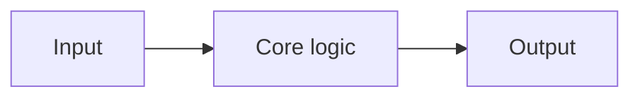

# Architecture

> Written by the `architect` subagent via `/plan-project`. Reviewed by the owner. Updated whenever structure changes.

## Purpose and users

<Two sentences.>

## Components

| Component | Responsibility | Talks to |
|---|---|---|
| | | |

## Data flow

<Prose walk-through of the main path.>

## Boundaries

<Where I/O, external services, persistence, and time are isolated from core logic, and how they are mocked in tests.>

## Key choices

| Choice | Decision | Alternative rejected | Why | ADR |
|---|---|---|---|---|
| | | | | |

## Non-functional requirements

- Security:
- Performance:
- Observability:
- Accessibility (if UI):

## Risks and open questions

-
